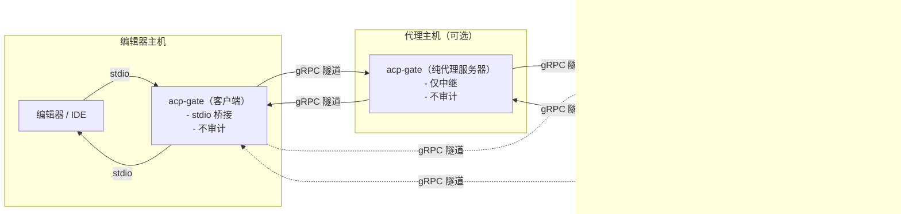

acp-gate
===

一个小型、透明的 ACP 代理，位于你的编辑器（上游）与真实的 ACP 代理（下游）之间。它会转发所有 ACP 流量，并将审计轨迹写入本地 SQLite 数据库。

基于 github.com/coder/acp-go-sdk 构建。

[English](README.md)

功能
-
- 编辑器与代理之间的透明 stdin/stdout 代理
- 对所有请求/响应进行持久化审计日志（SQLite）
- 尽力提取 user/agent 文本，便于浏览
- 使用简单的 JSON 配置管理命名的代理服务器
- 提供 CLI 覆盖项以便覆盖命令、参数与环境变量
- 通过 gRPC 支持远程模式（服务端/客户端），将编辑器与代理运行主机解耦
- 纯代理服务器模式：仅将字节转发到另一台 acp-gate 服务器（不启动本地代理，不审计）
- 可选代理跳点（客户端与服务器之间可插入一个或多个中转；中转不审计）
- 仅在远端“终端服务器”侧进行审计（客户端/中转节点不审计）

架构
-
下图展示了典型拓扑。只有实际拉起“下游 ACP 代理”的终端服务器会执行审计并写入 SQLite。



下载与安装
-
1) 从以下页面下载与你的操作系统/架构匹配的最新发行版：
   https://github.com/Tryanks/acp-gate/releases/latest

2) 解压后将 acp-gate 可执行文件放到 PATH 中
   （例如：macOS/Linux 放到 /usr/local/bin；Windows 将所在目录加入 PATH）。

3) macOS/Linux 可能需要授予执行权限：
   chmod +x acp-gate

快速开始
-
acp-gate 旨在由编辑器/IDE 作为“代理替身”启动。它会在后台拉起真实的下游代理，并在审计的同时代理全部消息。

示例：

1) 显式指定下游命令运行
```
acp-gate \
  -agent-cmd /usr/local/bin/my-acp-agent \
  -agent-arg --model \
  -agent-arg gpt-4o
```

2) 使用配置文件中定义的代理
```
acp-gate -config ~/.config/acp-gate/config.json -agent-name openai
```

gRPC 远程模式
-
在远程模式下，acp-gate 实例通过一个极简的 gRPC 隧道传输原始 ACP JSON-RPC 字节。这样可以将编辑器运行在一台机器上，而将代理运行在另一台机器上。也可以根据需要在两者之间插入可选的代理跳点。

模式：

1) 带本地代理与审计的服务器（终端服务器）
```
acp-gate -server 0 -config <cfg> -agent-name <name>
# 或不使用配置：
acp-gate -server 0 -agent-cmd <cmd> [-agent-arg ...]
```
说明：
- 当使用 -server 0 时，服务会绑定到一个临时端口，并在日志中输出实际地址。
- 每个入站连接都会由服务器拉起配置的下游代理，并将流量审计到 SQLite。

2) 客户端（不审计）
```
acp-gate -connect <host:port>
```
将编辑器的标准输入输出与远端服务器隧道桥接。客户端本地不会启动代理；不进行审计。

3) 纯代理服务器（不启动本地代理，不审计）
```
acp-gate -server 0 -connect <upstream_host:port>
```
接受客户端连接并将其中继到另一台 acp-gate 服务器。适合插入一个或多个跳点、跨越网络边界或添加垫片。纯代理跳点不审计；只有最终启动下游代理的服务器会审计。

链式组合
-
可按需在客户端与服务器之间插入一个或多个代理跳点（中转不审计）。参见上方架构图。


远程模式下的审计行为：
- 只有实际启动下游代理的“终端服务器”执行审计。
- 客户端与纯代理跳点不审计。

通用命令行参数
-
- -audit-db string
  审计 SQLite 数据库路径（默认：audit.sqlite）
- -config string
  JSON 配置文件路径，包含 agent_servers（默认：自动检测；见下）
- -agent-name string
  要使用的配置中代理服务器名称
- -agent-cmd string
  下游真实代理命令（覆盖配置）
- -agent-arg value
  下游代理参数（可重复）
- -server int
  以 gRPC 服务器模式运行并监听给定端口（0 表示自动绑定；实际地址会写入日志）
- -connect string
  以 gRPC 客户端模式运行，并连接到 host:port 的服务器

配置
-
当未提供 -config 时，acp-gate 会按以下顺序查找配置文件：
1) $XDG_CONFIG_HOME/.acp-gate/config.json
2) $XDG_CONFIG_HOME/acp-gate/config.json
3) ~/.config/.acp-gate/config.json
4) ~/.config/acp-gate/config.json

文件格式（JSON）：
```json
{
  "agent_servers": {
    "openai": {
      "command": "~/bin/acp-agent-openai",
      "args": ["--model", "gpt-4o"],
      "env": {
        "OPENAI_API_KEY": "..."
      }
    }
  }
}
```

说明：
- -agent-cmd 会覆盖配置中的 command。
- 最终的 argv 为 config.args 后接任意的 -agent-arg 参数。
- 环境变量来自 config.env，并与基础进程环境合并。
- 以 ~ 开头的命令路径会展开为当前用户的 home 目录。

安全性
-
当前 gRPC 隧道为简洁起见使用了非加密传输。如果需要加密与认证，请在部署时加入 TLS/mTLS 与鉴权。协议本身稳定，可直接与标准 gRPC 安全选项组合使用。

Proto 架构与 Buf
-
- 迷你 proto 架构位于 proto/acpgate/v1/tunnel.proto。
- 仓库包含 Buf 配置（buf.yaml、buf.gen.yaml），便于未来的类型化代码生成流水线。运行时采用小型的手写编解码器/描述信息，以保持二进制自包含。

审计
-
acp-gate 默认写入 ./audit.sqlite。每条记录包含：
- 时间戳
- 方向（upstream_to_downstream 或 downstream_to_upstream）
- 会话 ID（若可用）
- 方法名
- 原始 JSON 负载
- 尽力提取的 user_text/agent_text（适用于提示/响应分片与更新）

隐私提示：审计数据库可能包含完整的提示与响应内容。请谨慎处理。

许可证
-
本项目遵循仓库中的 LICENSE 文件所述的许可条款。
